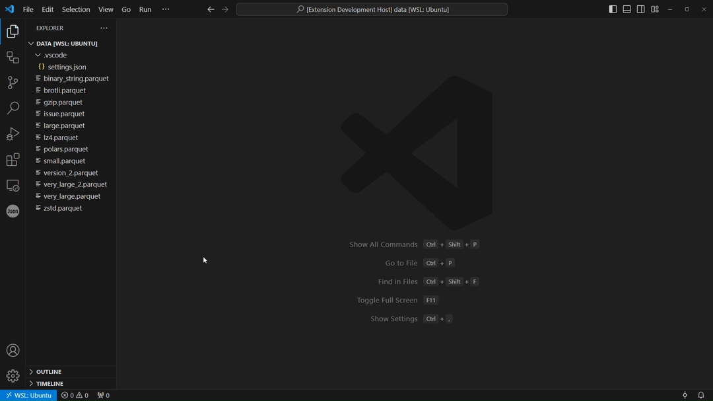

# Parquet Visualizer

### Inspect and query very large parquet files fast

## What's Parquet Visualizer
Parquet Visualizer is a tool that helps you easily query with SQL and inspect very large parquet files fast and easy.

## What can you do with Parquet Visualizer?
### Inspect Data
You can inspect the binary data of parquet files in a human readable tabular format with pagination. You can also change the page size.

### Inspect Struct Value
You can easily inspect complex struct values by clicking on the cell, which shows a popup containing the value of the struct.

### Run SQL Queries on a Parquet File
You can query a parquet file with DuckDB SQL. You can also search within the result, paginate the result or change the page size. 

### Advanced Autocomplete in Query Editor
By typing in the editor, an autocomplete box with column suggestions appear. This makes it much easier to write queries, by selecting the suggested columns.

### Search within rows of Query Result
By typing free text in the search box, find specific values of the query result.

### Export Query Result as CSV, JSON, ndJSON or Parquet to Disk
By clicking on the export button in the query tab, you can save your query result in CSV, JSON, ndJSON or Parquet format to disk.

### Copy Query Result to Clipboard
By clicking on the copy button in the querytab, you can copy the query result data to the clipboard.

### Inspect Schema
You can inspect the schema of the parquet file by clicking on the Schema tab, in which you can paginate if the file has many columns.

You can also inspect the struct type by clicking on the cell, which will show a popup containing the struct data type.

### Inspect Metadata
You can inspect the metadata in tabular format by clicking on the Metadata tab.

### Color Theme
The theme of the extension (black or white) is based on your VS Code Color theme. If the color theme is white, the extension will load it's light theme.

## Configuration
The following configuration options are available:

|name|default|description|
|----|-------|-----------|
|`parquet-visualizer.backend`|`duckdb`| Backend for reading the parquet file. Options: `duckdb`, `parquet-wasm`|
|`parquet-visualizer.defaultPageSizes`|`[20, 50, 100, 500]`|Set the default page size for data and query tab.|
|`parquet-visualizer.defaultQuery`|`SELECT *\r\nFROM data\r\nLIMIT 1000;`|Default SQL query for parquet file. The table `data` should remain the same.|
|`parquet-visualizer.RunQueryKeyBinding`|`Ctrl-Enter`|Default Key Binding for running queries. If Ctrl is written, it will be translated to Command for mac and vica versa. E.g., Ctrl-E will be synonymous to Command-E.|
|`parquet-visualizer.dateTimeFormat`|`ISO8601`|Set datetime format for columns of timestamp type. Defaults to ISO8601. You can set a custom format like `YYYY-MM-DD HH:mm:ss.SSS Z`. Find rules for formatting [here](https://www.npmjs.com/package/date-and-time#formatdateobj-arg-utc).|
|`parquet-visualizer.outputDateTimeFormatInUTC`|`true`|Outputs the datetime format for timestamp columns in UTC or in local time.|

## Parquet backends
This extension supports two different types of backends for visualizing and querying parquet files.

### DuckDB
[DuckDB](https://duckdb.org/docs/index) is the primary backend used for uncompressed and compressed parquet files (except for the BROTLI compression codec.)

### Parquet-wasm
[parquet-wasm](https://kylebarron.dev/parquet-wasm) is a backend that uses a Rust implementation of arrow and parquet. It supports all compression codecs except LZ4.

## Frontend
The tables of the frontend are powered by [tabulator](https://tabulator.info/).

The query editor of the frontend is powered by [ace](https://github.com/ajaxorg/ace).

